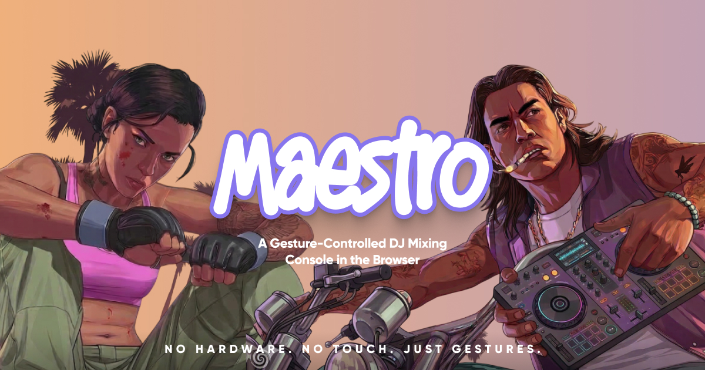

<p align="center">
  
</p>

<p align="center">
  <b>NO HARDWARE. NO TOUCH. JUST GESTURES.</b>
</p>

<p align="center">
  A browser-based DJ mixing console controlled entirely by hand gestures via your webcam.
</p>

---

## What is Maestro?

Maestro is a fully browser-based DJ controller that uses **real-time hand tracking** to let you mix audio with mid-air gestures. No MIDI controller, no touchscreen — just your hands and a webcam.

## Features

- **Gesture Control** — Pinch to grab, drag to adjust, tap to trigger
- **Dual Decks** — Two independent audio decks with play/pause and tempo control
- **3-Band EQ** — Low, mid, and high shelf filters per deck
- **Filter Sweep** — Low-pass filter with full frequency range
- **Delay FX** — Feedback delay effect per deck
- **Crossfader** — Equal-power crossfade between decks
- **8 Drum Pads** — Synthesized kick, snare, hi-hat, clap, tom, rim, perc, and FX
- **Waveform Display** — Real-time waveform visualization with playback position
- **Frequency Spectrum** — Live frequency analyzer per deck
- **Magnetic Snapping** — Cursor auto-targets nearby controls for easier interaction
- **Two-Hand Support** — Control two things simultaneously
- **Drag & Drop** — Load any audio file by dragging it onto a deck

## Tech Stack

| Layer | Technology |
|---|---|
| Hand Tracking | MediaPipe Hand Landmarker (WASM + GPU) |
| Audio Engine | Web Audio API |
| Frontend | React 19 |
| Sound Synthesis | Oscillators + noise buffers (no samples) |
| Visualization | Canvas 2D |
| Hosting | Vercel |

## How It Works

```
Webcam → MediaPipe Hand Landmarker → 21 Landmarks per Hand
  → Exponential Smoothing → Pinch Detection (hysteresis)
    → Magnetic Snap to nearest UI control
      → Drag delta x sensitivity → Audio parameter update
```

1. **Show your hand** — Hold your hand in front of the webcam
2. **Pinch to grab** — Touch your thumb and index finger to grab a control
3. **Drag to adjust** — Move your hand while pinching to change values
4. **Release to let go** — Open your fingers to drop the control

## Getting Started

```bash
git clone https://github.com/anmolbhardwaj17/Maestro.git
cd Maestro
npm install
npm start
```

Open [http://localhost:3000](http://localhost:3000) and allow camera access.

## Requirements

- Modern browser (Chrome/Edge recommended for GPU-accelerated hand tracking)
- Webcam
- Audio files to mix (drag & drop onto the decks)

## Author

**Anmol Bhardwaj** — [anmolbhardwaj.com](https://anmolbhardwaj.com)

## License

MIT
